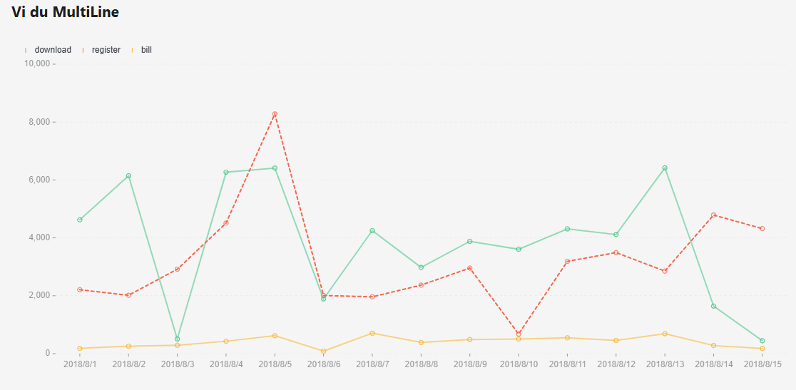

# Learn Ant-Design
## 1.Trang web được tạo bởi:
- 
- 
- 
- 
-   
## 2.Các kiến thức về ant-design được áp dụng:
 - Button
 - Icon
 - Grid
 - Flex
 - Layout
 - Dropdown
 - Menu
 - Input
 - Form
 - CheckBox
 - DatePicker
 - Select
 - Switch
 - Badge
 - Image
 - Table
 - Tab
 - Tag
 - Tooltip...

 Tài liệu [https://ant.design/components/overview](https://ant.design/components/overview)
## 3.Sử dụng thư viện chart.js vẽ được các biểu đồ:
  - Basic Line
    
    
  - MultiLine
    
    
  - StepLine
  - BasicArea
  - BasicColumn

    
  - GroupedColumn
  - BasicPie

    
    
Tài liệu đã học [https://ant-design-charts.antgroup.com/](https://ant-design-charts.antgroup.com/)
